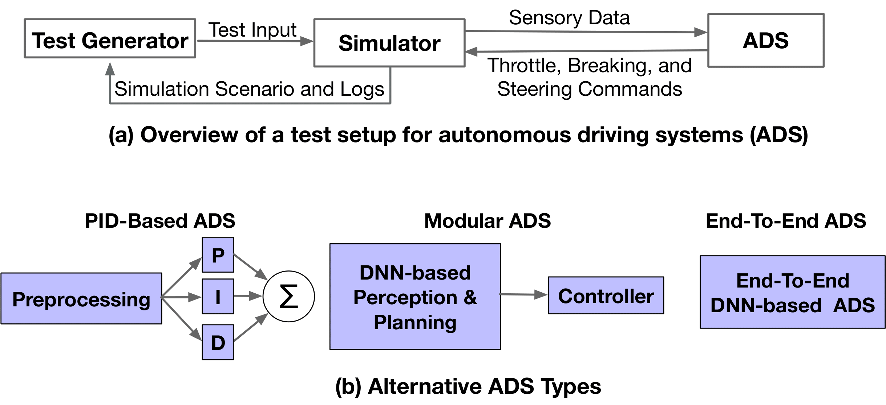
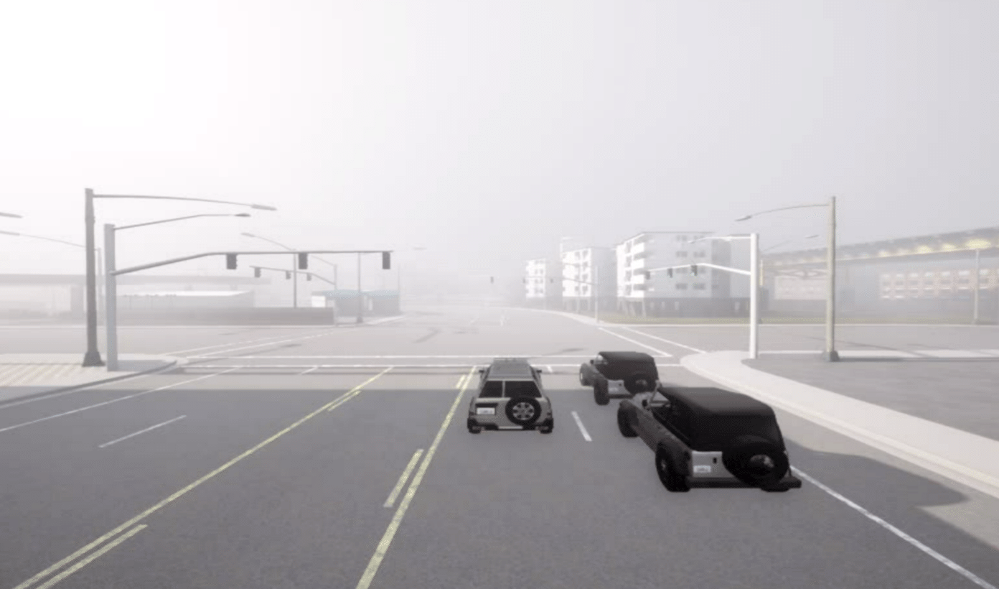
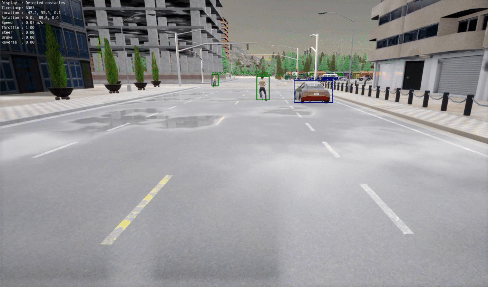
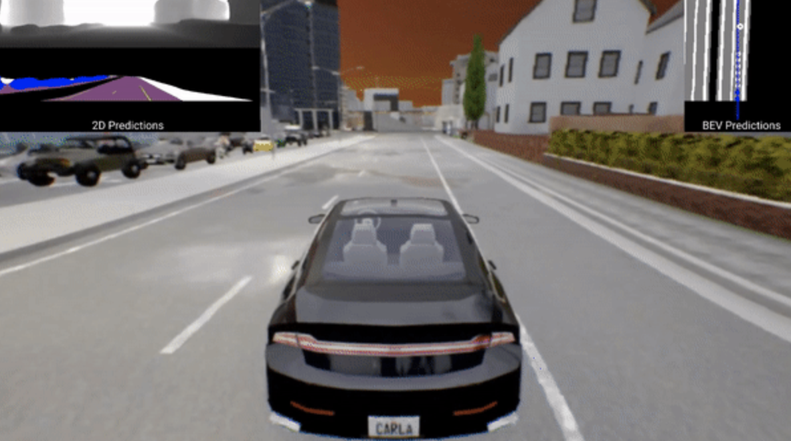
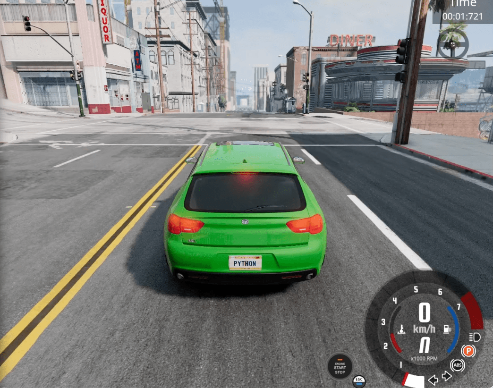
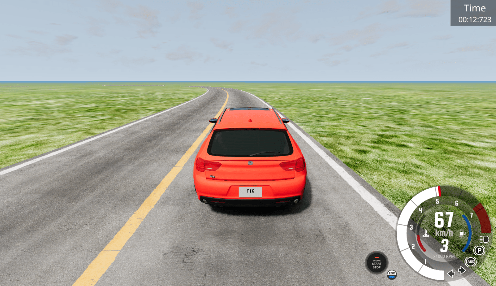

# Test Setups

Our paper uses five different test setups in order to evaluate their flakiness in simulating autonomous driving scenarios. These five test setups are the following.

- PID
- Pylot
- Tran
- BeamNG
- Comp

PID, Pylot, and Transfuser use the Carla Simulator, while the BeamNG and Comp use the BeamNG Simulator. The following sections will provide details on the inputs, fitness functions, and scripts used for each ADS.

## PID

The PID test setup uses Carla Simulator and Carla ADS as its ADS. Carla ADS uses a Proportional Integral Derivative (PID) controller to control the vehicle's speed and steering angle.

### Inputs

The inputs for this test setup are:

- **Weather1**: Weather condition first parameter
- **Weather2**: Weather condition second parameter
- **Weather3**: Weather condition third parameter
- **Ego**: Ego vehicle blueprint
- **NonEgo**: Non-ego vehicle blueprint
- **Front**: No of vehicles in front of ego vehicle
- **Back**: No of vehicles behind ego vehicle
- **Opposite**: No of vehicles opposite to ego vehicle

## Thresholds

The thresholds for this test setup are, respectively, `[-1.5, -90, -1000, -10]`.

### Implementation

This test setup is developed by the authors of the paper. The script used for this test setup is located in the `pid` folder.

## Pylot

The Pylot test setup uses Carla Simulator and Pylot ADS as its ADS. Pylot ADS uses deep learning in its modular approach to control the vehicle's speed and steering angle.

### Inputs

The inputs for this test setup are:

- **Road type**: Type of road
- **Road ID**: ID of the road
- **Scenario Length**: Length of the scenario
- **Vehicle_in_front**: Vehicle in front of ego vehicle
- **vehicle_in_adjcent_lane**: Vehicle in adjacent lane to ego vehicle
- **vehicle_in_opposite_lane**: Vehicle in opposite lane to ego vehicle
- **vehicle_in_front_two_wheeled**: Two-wheeled vehicle in front of ego vehicle
- **vehicle_in_adjacent_two_wheeled**: Two-wheeled vehicle in adjacent lane to ego vehicle
- **vehicle_in_opposite_two_wheeled**: Two-wheeled vehicle in opposite lane to ego vehicle
- **time of day**: Time of day
- **Weather**: Weather condition
- **Number of People**: Number of people in the scenario
- **Target Speed**: Target speed of ego vehicle
- **Trees in scenario**: Number of trees in the scenario
- **Buildings in Scenario**: Number of buildings in the scenario
- **task**: Task to be performed

## Thresholds

The thresholds for this test setup are, respectively, `[0, 0, 0, 0]`.

### Implementation

This test setup uses implementation of the paper _Many-Objective Reinforcement Learning for Online Testing of DNN-Enabled Systems_. Here's the link to their [replication packege](https://figshare.com/articles/software/Replication_Package_for_Many-Objective_Reinforcement_Learning_for_Online_Testing_of_DNN-Enabled_Systems_/20526867)

## Tran

The Tran ADS is based on the Carla Simulator and uses a transfer learning approach to control the vehicle's speed and steering angle.

### Inputs

The inputs for this ADS are:

- **Duration**: Duration of the scenario
- **Route ID**: ID of the route

### Implementation

This test setup uses implementation of the transfuser github repository. Here's the link to their [github repository](https://github.com/autonomousvision/transfuser)

## BeamNG

The BeamNG ADS uses the BeamNG Simulator and BeamNG AI as its ADS.

### Inputs

The inputs for this ADS are:

- **Target Index**: Index of the target destination
- **TimeOfDay**: Time of day
- **Ego Speed**: Speed of the ego vehicle
- **TrafficAmount**: Amount of traffic
- **Keep Lane**: Whether to keep lane or not
- **Weather**: Weather condition

## Thresholds

The thresholds for this test setup are, respectively, `[1500, -1, -1000, 65]`.

### Implementation

This test setup is developed by the authors of the paper. The script used for this test setup is located in the `beamng` folder.

## Comp

The Comp ADS is also based on the BeamNG Simulator. It uses the BeamNG AI as its ADS.

### Inputs

The inputs for this ADS are:

- **x1**: x coordinate of the first main point of the road
- **y1**: y coordinate of the first main point of the road
- **x2**: x coordinate of the second main point of the road
- **y2**: y coordinate of the second main point of the road
- **x3**: x coordinate of the third main point of the road
- **y3**: y coordinate of the third main point of the road
- **x4**: x coordinate of the fourth main point of the road
- **y4**: y coordinate of the fourth main point of the road

## Threshold

The threshold for this test setup is `0.9`.

### Implementation

This test setup uses the implementation of the [Cyber-Physical Systems Testing Tool Competition](https://github.com/sbft-cps-tool-competition/cps-tool-competition). We've developed a road generator for the competition which is located in the `comp` folder.
